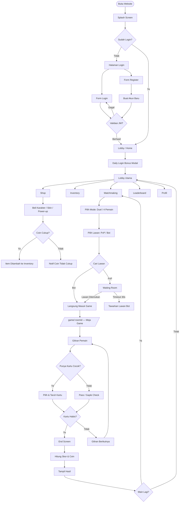

# PRD — GAPLE ROYALE
### Indonesian Premium Casino Domino Game — Web Application
> Versi: 1.0.0 | Status: Siap Build & Deploy | Bahasa: Indonesia

---

## RINGKASAN STRATEGI

| Area | Keputusan | Alasan |
|---|---|---|
| Archetype | Luxury Casino Game Web App | Game online premium, experience-first, bukan utility |
| Business Model | Free-to-play + Coin Economy (virtual, tidak ada pembayaran nyata) | Sesuai konteks proyek kuliah, tidak butuh payment gateway nyata |
| Conversion Event | Register → Mainkan game pertama → Beli karakter pertama | Funnel engagement, bukan monetisasi |
| Animation Level | Immersive | Casino feel butuh efek dramatis, chip fly, card flip, coin rain |
| Tema Visual | Dark Casino Luxury | Background hijau tua/hitam, gold accent, ivory card, felt texture |
| Auth | JWT simulasi (localStorage) | Backend simulasi, tidak perlu server nyata untuk demo |
| Database | MySQL + Node.js (spek lengkap disertakan) | Siap deploy real jika dibutuhkan |
| Deployment | Static frontend → GitHub Pages / Netlify (gratis) + Backend optional Node.js → Railway (gratis) | 100% gratis |
| Stack Frontend | HTML5 + CSS3 + Vanilla JS (satu bundle, zero dependency wajib) | Portabel, tidak butuh build tools untuk demo |
| Stack Backend | Node.js + Express + MySQL + Socket.io | Sesuai materi kuliah Sistem Terdistribusi |
| Animation Library | GSAP (CDN) | Kontrol penuh untuk efek casino yang dramatis |

### Scope Rilis Ini (Semua Dibangun Sekaligus)

- ✅ Splash screen + loading
- ✅ Auth (register, login, JWT simulasi)
- ✅ Lobby / Home dengan coin display, avatar, quick stats
- ✅ Shop (beli karakter, skin kartu, power-up dengan coin)
- ✅ Inventory (koleksi item pemain)
- ✅ Matchmaking (duel 1v1 dan 4 pemain, vs Bot atau PvP)
- ✅ Game Table (meja casino, gameplay Gaple lengkap)
- ✅ Power-up system (Shuffle, Peek, Block, Double Coin)
- ✅ In-game chat + emoji
- ✅ End Screen (hasil, coin earned, stats ronde)
- ✅ Leaderboard (global + mingguan)
- ✅ Profil & Statistik pemain
- ✅ Daily Login Bonus
- ✅ Daily Mission + Achievement
- ✅ Bot AI (2 level: Easy, Hard)
- ✅ 4 Karakter 2D (CSS/SVG art, bukan gambar eksternal)
- ✅ Dokumentasi API lengkap
- ✅ Skema database MySQL
- ✅ Panduan deploy (GitHub Pages + Railway)

### Tidak Relevan — Dikecualikan

- ❌ Payment gateway nyata (coin hanya virtual, tidak ada transaksi uang)
- ❌ Push notification mobile (bukan aplikasi mobile native)
- ❌ Social media login (scope terlalu luas untuk proyek ini)

---

## BAGIAN 1 — OVERVIEW PROYEK

**Gaple Royale** adalah web game domino bergaya casino premium yang dapat dimainkan langsung di browser tanpa instalasi. Pemain mendaftar, memilih karakter 2D unik, lalu bertanding melawan pemain lain atau bot AI di meja domino bergaya Las Vegas. Sistem coin virtual memungkinkan pemain membeli karakter baru, skin kartu, dan power-up untuk meningkatkan strategi bermain.

Proyek ini dibangun sebagai implementasi nyata dari materi kuliah Sistem Terdistribusi, di mana setiap service (Login, Matchmaking, Chat, Ranking, User) dibangun sebagai microservice terpisah namun terintegrasi dalam satu game yang utuh dan playable.

**Target Pengguna:** Mahasiswa teknik informatika yang ingin melihat implementasi nyata sistem terdistribusi, sekaligus pemain kasual yang ingin bermain domino online.

---

## BAGIAN 2 — DESIGN SYSTEM (CASINO PREMIUM)

### 2.1 Color Palette — "Velvet Noir Casino"

```css
:root {
  /* === BACKGROUNDS === */
  --bg-void:        #080a06;   /* Latar paling gelap — body background */
  --bg-primary:     #0d110a;   /* Layar utama, shell game */
  --bg-surface:     #141a10;   /* Card, panel, sidebar */
  --bg-felt:        #0f3d1e;   /* Meja casino — felt hijau tua */
  --bg-felt-light:  #145a2a;   /* Meja casino highlight area */
  --bg-felt-dark:   #091c10;   /* Meja casino shadow area */
  --bg-elevated:    #1e2619;   /* Elevated card, modal */
  --bg-overlay:     rgba(8, 10, 6, 0.88); /* Modal overlay */

  /* === GOLD ACCENT (primary brand) === */
  --gold-bright:    #f5c842;   /* CTA utama, highlight aktif */
  --gold-warm:      #d4a017;   /* Default gold, border premium */
  --gold-deep:      #9a7010;   /* Gold gelap, shadow */
  --gold-pale:      #fef0a0;   /* Gold muda, shimmer effect */
  --gold-gradient:  linear-gradient(135deg, #f5c842 0%, #d4a017 50%, #f5c842 100%);

  /* === CARD COLORS === */
  --card-ivory:     #f5f0e8;   /* Permukaan kartu domino */
  --card-border:    #d4b896;   /* Border kartu */
  --card-pip:       #1a1008;   /* Titik-titik pada domino */
  --card-shadow:    rgba(0,0,0,0.6); /* Bayangan kartu */

  /* === TEXT === */
  --text-primary:   #f0ead6;   /* Teks utama, warm ivory */
  --text-secondary: rgba(240,234,214,0.55); /* Teks sekunder */
  --text-muted:     rgba(240,234,214,0.30); /* Placeholder, disabled */
  --text-gold:      #f5c842;   /* Teks gold untuk emphasis */
  --text-dark:      #0d110a;   /* Teks di atas background terang */

  /* === STATUS === */
  --status-win:     #2ecc71;   /* Menang */
  --status-lose:    #e74c3c;   /* Kalah */
  --status-neutral: #95a5a6;   /* Draw / pass */
  --status-warning: #f39c12;   /* Peringatan */

  /* === BORDER === */
  --border-default: rgba(212,160,23,0.15); /* Border umum */
  --border-gold:    rgba(212,160,23,0.45); /* Border premium */
  --border-bright:  rgba(245,200,66,0.8);  /* Border aktif / focus */

  /* === CHIPS (warna chip casino) === */
  --chip-red:    #c0392b;
  --chip-blue:   #2980b9;
  --chip-green:  #27ae60;
  --chip-black:  #2c3e50;
  --chip-purple: #8e44ad;
  --chip-gold:   #d4a017;
}
```

### 2.2 Typography

```css
/* Google Fonts (gratis): */
/* @import url('https://fonts.googleapis.com/css2?family=Cinzel:wght@400;600;700;900&family=Crimson+Pro:ital,wght@0,300;0,400;0,600;1,300;1,400&family=JetBrains+Mono:wght@400;600&display=swap'); */

:root {
  --font-display: 'Cinzel', 'Times New Roman', serif;
    /* Digunakan: logo, judul halaman, nama karakter, angka skor besar */
    /* Karakter: elegant, classical, authoritative — seperti nama kasino Las Vegas */

  --font-body: 'Crimson Pro', 'Georgia', serif;
    /* Digunakan: deskripsi, chat, statistik, teks naratif */
    /* Karakter: readable luxury serif, terasa mahal tapi nyaman dibaca */

  --font-mono: 'JetBrains Mono', monospace;
    /* Digunakan: kode room, angka coin, timer countdown */

  /* Scale */
  --text-hero:    clamp(48px, 8vw, 120px);   /* Logo game, judul splash */
  --text-display: clamp(32px, 5vw, 72px);    /* Section headline */
  --text-heading: clamp(22px, 3vw, 40px);    /* Card heading, modal title */
  --text-lg:      20px;
  --text-md:      16px;
  --text-sm:      14px;
  --text-xs:      12px;
  --text-label:   11px;

  /* Line heights */
  --lh-display: 0.95;
  --lh-heading: 1.1;
  --lh-body:    1.65;

  /* Letter spacing */
  --ls-display: -0.02em;
  --ls-label:   0.14em;
  --ls-wide:    0.25em;
}
```

**Rationale tipografi:** Cinzel dipilih karena DNA-nya berasal dari romawi kuno — sama seperti nuansa casino mewah yang menggunakan serif klasik di signage, chip, dan meja. Crimson Pro sebagai body font memberikan karakter editorial yang warm dan readable dalam dark background.

### 2.3 Motion Tokens

```css
:root {
  /* Duration */
  --dur-instant:  80ms;
  --dur-fast:     150ms;
  --dur-normal:   300ms;
  --dur-slow:     500ms;
  --dur-dramatic: 800ms;
  --dur-scene:    1200ms;

  /* Easing */
  --ease-out:     cubic-bezier(0.16, 1, 0.3, 1);      /* Standar */
  --ease-spring:  cubic-bezier(0.34, 1.56, 0.64, 1);   /* Card flip, bounce */
  --ease-casino:  cubic-bezier(0.22, 1, 0.36, 1);      /* Efek dramatik masuk layar */
  --ease-gold:    cubic-bezier(0.65, 0, 0.35, 1);      /* Coin drop */
  --ease-in:      cubic-bezier(0.4, 0, 1, 1);          /* Exit animations */
}
```

### 2.4 Spacing (8pt grid)

```css
:root {
  --sp-1: 4px;   --sp-2: 8px;   --sp-3: 12px;  --sp-4: 16px;
  --sp-5: 24px;  --sp-6: 32px;  --sp-7: 48px;  --sp-8: 64px;
  --sp-9: 96px;  --sp-10: 128px;
  --radius-sm: 4px;  --radius-md: 8px;
  --radius-lg: 16px; --radius-xl: 24px;
  --radius-full: 9999px;
}
```

---

## BAGIAN 3 — SITEMAP & HALAMAN

```
GAPLE ROYALE
├── /splash              → Splash Screen (auto-redirect 3s)
├── /auth
│   ├── /auth/login      → Login
│   └── /auth/register   → Register
├── /lobby               → Home / Lobby (setelah login)
│   ├── Daily Login Bonus (modal auto-muncul)
│   └── Daily Mission Panel (side panel)
├── /shop                → Toko Item
│   ├── /shop/characters → Tab Karakter
│   ├── /shop/cards      → Tab Skin Kartu
│   └── /shop/powerups   → Tab Power-up
├── /inventory           → Inventori Pemain
├── /matchmaking         → Pilih Mode & Cari Lawan
│   ├── Mode: Duel (1v1)
│   └── Mode: 4 Pemain
├── /game/:roomId        → Meja Game (gameplay utama)
├── /result/:roomId      → End Screen / Hasil Game
├── /leaderboard         → Papan Peringkat
│   ├── Tab: Global
│   └── Tab: Mingguan
└── /profile/:userId     → Profil & Statistik
```

---

## BAGIAN 4 — USER FLOW (Mermaid)



---

## BAGIAN 5 — HALAMAN & SPESIFIKASI SEKSI

### 5.1 Halaman: Splash Screen (`/splash`)

Splash screen muncul 3 detik saat pertama buka website. Menampilkan logo GAPLE ROYALE dengan animasi masuk dramatis, lalu otomatis redirect ke `/auth/login` atau `/lobby` berdasarkan status login.

**Seksi: Logo Area**
- Konten: Teks "GAPLE ROYALE" dalam font Cinzel, ukuran `--text-hero`
- Di bawah logo: tagline "Meja Terbaik, Taruhan Terbesar" dalam Crimson Pro italic
- Background: `--bg-void` dengan efek felt texture CSS (subtle repeating pattern)
- Animasi: Logo fade-in dari scale(0.8) ke scale(1) + opacity 0→1, duration 800ms, ease `--ease-casino`
- Tagline masuk 400ms setelah logo, slide up 20px
- Setelah 2.4s: fade-out keseluruhan 600ms, lalu redirect
- State loading: 3 titik gold berkedip di bawah logo

**Seksi: Background Effect**
- Elemen: Grid garis halus hijau sangat gelap (CSS grid pattern, tidak ada gambar)
- Overlay: radial gradient gold sangat samar dari tengah (opacity 0.08)
- Partikel: 12 titik gold kecil bergerak perlahan (CSS animation, tidak ada canvas)

**Komponen:** `SplashScreen` — tidak ada props, self-contained, auto-redirect
**State:** `loading | redirecting`
**Acceptance:** Splash tampil maksimal 3 detik, tidak ada interaksi diperlukan

---

### 5.2 Halaman: Auth (`/auth/login` dan `/auth/register`)

Halaman autentikasi single-page dengan dua tab: Login dan Register. Background menggunakan meja casino sebagai konteks visual. Form berada di tengah dalam card glass.

**Seksi: Background**
- Full-screen felt texture hijau tua (`--bg-felt`)
- Overlay: radial gradient gelap dari pojok atas kiri dan kanan (efek spotlight ke tengah)
- Kartu domino dekoratif tersebar di background (CSS-only, opacity 0.06, tidak interaktif)

**Seksi: Auth Card**
- Posisi: center screen, max-width 420px
- Style: glass panel — `background: rgba(20,26,16,0.92)`, border `1px solid var(--border-gold)`, `backdrop-filter: blur(20px)`, `border-radius: var(--radius-xl)`
- Header: Logo kecil + nama game di atas form
- Tab switcher: "Masuk" | "Daftar" — active tab bergaris bawah gold, transisi smooth

**Seksi: Form Login**
- Field 1: Username — `type="text"`, placeholder "Nama Pengguna", required, min 3 char
  - Error: "Username minimal 3 karakter"
- Field 2: Password — `type="password"`, placeholder "Kata Sandi", required, min 6 char
  - Error: "Password minimal 6 karakter"
- Tombol: "MASUK KE MEJA" — full width, background `--gold-gradient`, teks `--text-dark`, font Cinzel
- Teks kecil: "Belum punya akun? Daftar →" (klik switch ke tab register)
- Loading state: tombol disabled + spinner gold

**Seksi: Form Register**
- Field 1: Username — required, min 3 char, max 20 char, hanya alfanumerik
  - Error realtime: "Username sudah dipakai" (cek localStorage)
  - Error: "Hanya huruf dan angka"
- Field 2: Email — `type="email"`, required
  - Error: "Format email tidak valid"
- Field 3: Password — required, min 6 char
- Field 4: Konfirmasi Password — harus sama dengan Field 3
  - Error: "Password tidak sama"
- Tombol: "BUAT AKUN BARU" — full width, gold gradient
- Loading state: disabled + spinner

**Data yang disimpan saat register:**
```javascript
{
  userId: UUID,
  username: string,
  email: string,
  passwordHash: btoa(password), // simulasi hash, bukan production
  createdAt: timestamp,
  coin: 1000,           // koin awal
  activeCharacter: 'raja_domino', // karakter default gratis
  activeSkin: 'classic',
  inventory: ['raja_domino', 'classic'],
  stats: { wins: 0, losses: 0, totalGames: 0, totalCoinEarned: 0 },
  achievements: [],
  lastLogin: null,
  loginStreak: 0
}
```

**JWT Simulasi:**
```javascript
function createJWT(userId) {
  const payload = btoa(JSON.stringify({ userId, exp: Date.now() + 86400000 }));
  return `gaple.${payload}.simulasi`;
}
function verifyJWT(token) {
  try {
    const parts = token.split('.');
    const payload = JSON.parse(atob(parts[1]));
    return payload.exp > Date.now() ? payload : null;
  } catch { return null; }
}
```

**State semua field:** default | focused (gold border) | filled | error (red border + pesan) | success (green border)
**Acceptance:** Login berhasil → simpan token ke localStorage → redirect `/lobby`. Validasi berjalan sebelum submit. Error ditampilkan di bawah field terkait.

---

### 5.3 Halaman: Lobby / Home (`/lobby`)

Lobby adalah pusat kendali pemain. Pemain melihat saldo coin, avatar aktif, statistik singkat, dan dapat navigate ke semua fitur. Daily login bonus muncul otomatis sebagai modal saat pertama login hari itu.

**Layout:** Sidebar kiri (navigasi) + Area konten kanan. Pada mobile: bottom navigation.

**Seksi: Sidebar Navigasi**
- Logo GAPLE ROYALE kecil di atas
- Avatar pemain + username + coin balance
- Menu: Lobby | Shop | Inventory | Leaderboard | Profil
- Active state: item aktif diberi border left gold 3px + teks gold
- Tombol Logout di paling bawah

**Seksi: Header Lobby**
- Greeting: "Selamat Datang, [Username]" dalam Cinzel
- Coin display besar: ikon chip + angka dengan animasi counting-up saat pertama load
- Tombol "MAIN SEKARANG" — CTA utama, gold gradient, ukuran besar, redirect ke `/matchmaking`

**Seksi: Daily Mission**
- Card dengan 3 misi harian, diambil dari `getMissions(date)`:
  1. "Main 3 Ronde" → reward 150 coin
  2. "Menangkan 1 Game" → reward 300 coin
  3. "Chat 5 Pesan dalam Game" → reward 100 coin
- Progress bar per misi (hijau)
- Tombol "Klaim" muncul saat completed (gold, disabled jika sudah diklaim)
- Reset setiap hari jam 00:00

**Seksi: Quick Stats**
- 4 kartu statistik mini: Total Game | Menang | Kalah | Win Rate
- Masing-masing dengan ikon, angka besar Cinzel, label kecil

**Seksi: Karakter Aktif**
- Card menampilkan karakter 2D aktif (SVG/CSS art) + nama + passive skill description
- Tombol "Ganti Karakter" → redirect ke `/inventory`

**Seksi: Recent Achievement**
- 3 achievement terakhir yang dibuka, dalam card horizontal scroll
- Setiap achievement: ikon + nama + tanggal dibuka

**Modal: Daily Login Bonus**
- Muncul otomatis jika `lastLogin !== today`
- Menampilkan: Hari ke-[N] streak login, jumlah coin reward
- Animasi: coin jatuh dari atas (CSS particles, tidak ada library tambahan)
- Tabel 7 hari dengan reward: 100, 150, 200, 300, 300, 400, 500 coin
- Tombol "KLAIM" → tambah coin, tutup modal, update `lastLogin` dan `loginStreak`
- Jika streak terputus (skip hari): reset ke hari 1

---

### 5.4 Halaman: Shop (`/shop`)

Pemain menggunakan coin untuk membeli karakter, skin kartu, dan power-up. Tidak ada uang nyata yang terlibat. Semua item ditampilkan dalam grid dengan preview, harga, dan tombol beli.

**Seksi: Tab Navigation**
- 3 tab: Karakter | Skin Kartu | Power-up
- Active tab bergaris bawah gold, transisi underline slide

**Tab: Karakter**

4 karakter tersedia, semua dengan desain 2D CSS/SVG (tidak butuh gambar eksternal):

| ID | Nama | Passive Skill | Harga | Unlock |
|---|---|---|---|---|
| `raja_domino` | Raja Domino | Bonus coin +15% tiap menang | Gratis | Default |
| `si_hoki` | Si Hoki | Lihat 1 kartu lawan per game (sekali) | 800 coin | Beli |
| `juragan_meja` | Juragan Meja | Undo 1 langkah per game | 1.500 coin | Beli |
| `sang_bluffer` | Sang Bluffer | Skip tanpa penalty 1x per game | 2.500 coin | Beli |

Desain karakter 2D (CSS/SVG art — semua dibuat dengan shapes, tidak ada gambar):
- **Raja Domino:** Siluet pria paruh baya, mahkota gold, baju merah tua, kumis tebal. Wajah dominan.
- **Si Hoki:** Pemuda dengan topi kuning miring, kaos kasual, senyum lebar. Terasa friendly.
- **Juragan Meja:** Pria besar berkemeja batik, tangan meja, ekspresi serius berwibawa.
- **Sang Bluffer:** Pria muda berkacamata, kartu domino di tangan, ekspresi misterius.

Setiap kartu karakter:
- Preview karakter besar (SVG art, 200×300px)
- Nama dalam Cinzel
- Badge passive skill (gold border)
- Harga dengan ikon coin
- Tombol "BELI" (gold) atau "SUDAH DIMILIKI" (disabled) atau "AKTIFKAN" (green)
- Hover: card naik 4px, shadow lebih kuat, border gold lebih terang

**Tab: Skin Kartu**

| ID | Nama | Preview | Harga |
|---|---|---|---|
| `classic` | Classic Ivory | Putih gading, border coklat | Gratis |
| `midnight` | Midnight Black | Hitam matte, titik putih | 600 coin |
| `royal_gold` | Royal Gold | Putih dengan border gold shimmer | 1.200 coin |
| `emerald` | Emerald Felt | Hijau emerald, titik cream | 900 coin |

Setiap kartu skin: preview domino mini (CSS-rendered), nama, harga, tombol beli/aktifkan.

**Tab: Power-up**

Power-up bisa dibeli berkali-kali, tersimpan di inventory sebagai "stok":

| ID | Nama | Efek | Harga per Unit | Stok Maks |
|---|---|---|---|---|
| `shuffle` | Shuffle | Acak ulang kartu di tangan (1x per game) | 50 coin | 99 |
| `peek` | Peek | Intip 1 kartu acak lawan (1x per game) | 80 coin | 99 |
| `block` | Block | Paksa lawan skip 1 giliran berikutnya | 100 coin | 99 |
| `double_coin` | Double Coin | Coin yang didapat ronde ini ×2 | 120 coin | 99 |

UI beli power-up: angka stok saat ini + tombol -/+ untuk pilih jumlah beli + tombol BELI.

**State transaksi:**
- Loading: spinner di tombol beli
- Success: animasi coin terbang ke coin counter di header, toast "Item berhasil dibeli!"
- Error (coin kurang): modal "Coin tidak cukup. Kamu butuh [X] coin lagi." + progress bar visual
- Error (stok maks): "Stok sudah maksimum"

---

### 5.5 Halaman: Inventory (`/inventory`)

Pemain melihat semua item yang dimiliki. Karakter dan skin bisa diaktifkan dari sini. Power-up menampilkan jumlah stok.

**Seksi: Tab Navigation**
- 3 tab: Karakter | Skin Kartu | Power-up (sama struktur seperti shop)

**Seksi: Karakter Inventory**
- Grid karakter yang dimiliki (sama desain 2D seperti shop)
- Badge "AKTIF" (green glow) pada karakter yang sedang aktif
- Tombol "AKTIFKAN" pada karakter lain
- Klik tombol AKTIFKAN → update `activeCharacter` di localStorage → badge berpindah

**Seksi: Skin Kartu Inventory**
- Grid skin yang dimiliki dengan preview kartu domino
- Badge "AKTIF" pada skin aktif
- Tombol "AKTIFKAN" pada skin lain

**Seksi: Power-up Inventory**
- List power-up dengan stok tersisa
- Tombol "BELI LAGI" yang redirect ke `/shop/powerups`

---

### 5.6 Halaman: Matchmaking (`/matchmaking`)

Pemain memilih mode game dan tipe lawan sebelum masuk meja. Halaman ini juga berfungsi sebagai waiting room saat mencari lawan PvP.

**Seksi: Pilih Mode Game**
- 2 pilihan besar (card, klik untuk pilih):
  - **DUEL (1v1):** Ikon 2 orang berhadapan, deskripsi singkat
  - **4 PEMAIN:** Ikon 4 orang di meja, deskripsi singkat
- Active card: border gold, sedikit terangkat, background lebih terang

**Seksi: Pilih Tipe Lawan**
- 2 pilihan (muncul setelah mode dipilih, animasi slide-down):
  - **Lawan Bot:** Ikon robot, langsung masuk game, pilih level (Easy / Hard)
  - **Lawan Pemain:** Ikon manusia, cari lawan online (simulasi)

**Seksi: Bot Level Selection** (jika pilih Bot)
- 2 tombol: "MUDAH" dan "SULIT"
- Deskripsi level:
  - Mudah: Bot memilih kartu secara acak dari kartu yang valid
  - Sulit: Bot menggunakan strategi greedy (prioritas kartu bernilai tinggi, blokir lawan)
- Tombol "MULAI GAME" → generate roomId → redirect ke `/game/:roomId`

**Seksi: Waiting Room** (jika pilih PvP)
- Animasi: lingkaran radar berputar (CSS animation)
- Teks: "Mencari Lawan..." dengan titik-titik beranimasi
- Counter: "Waktu menunggu: [N]s"
- Simulasi: setelah 5 detik, "lawan ditemukan" (Bot yang berpura-pura jadi pemain), masuk game
- Tombol "BATALKAN" di bawah — kembali ke matchmaking

**State:** `selecting_mode | selecting_opponent | selecting_bot_level | searching | found | error`

---

### 5.7 Halaman: Game Table (`/game/:roomId`)

Ini adalah halaman utama gameplay. Meja domino bergaya casino ditampilkan di tengah dengan kartu pemain di bawah dan lawan di atas. Gameplay mengikuti aturan Gaple standar Indonesia.

**Layout Game:**
```
┌─────────────────────────────────────────────────────┐
│  [Header: Room ID | Timer Giliran | Coin | Pause]   │
├─────────────────────────────────────────────────────┤
│  [Avatar Lawan 1]    [Avatar Lawan 2]    [Avatar 3] │
│  [Kartu Lawan: tampak belakang, N kartu tersisa]    │
├─────────────────────────────────────────────────────┤
│                                                     │
│              [MEJA DOMINO — PAPAN TENGAH]           │
│         [Kartu yang sudah dimainkan, chain]         │
│                                                     │
├─────────────────────────────────────────────────────┤
│  [Power-up bar: Shuffle | Peek | Block | 2xCoin]   │
│  [Kartu Pemain: tampak depan, bisa diklik/pilih]   │
│  [Tombol PASS — hanya aktif jika tidak bisa taruh] │
├─────────────────────────────────────────────────────┤
│  [Chat Panel — bisa di-toggle, float kanan bawah]  │
└─────────────────────────────────────────────────────┘
```

**Seksi: Header Game**
- Kiri: Room ID (kode pendek)
- Tengah: Timer giliran — countdown 30 detik per giliran, progress bar gold
- Kanan: Saldo coin + tombol pause (hanya untuk game vs bot)

**Seksi: Area Lawan**
- Setiap lawan: Avatar (karakter 2D kecil, 60×80px) + username + jumlah kartu tersisa
- Kartu lawan tampak belakang (desain CSS — ivory dengan pattern sesuai skin)
- Lawan yang sedang giliran: avatar glow gold + animasi thinking (titik berkedip)

**Seksi: Meja Domino (Board)**
- Background: `--bg-felt` dengan texture CSS (subtle grid pattern hijau)
- Border meja: rounded rectangle, border gold
- Kartu yang dimainkan: chain horizontal/vertikal, auto-scroll jika chain panjang
- Setiap kartu di papan: CSS-rendered domino (rectangle putih, divider tengah, titik-titik black)
- Ujung kiri dan kanan chain: highlight gold border (area sambung)
- Animasi taruh kartu: kartu slide masuk dari posisi tangan pemain ke posisi di board (GSAP)

**Seksi: Kartu Pemain**
- Kartu tampak depan, sesuai skin aktif
- Kartu yang bisa disambung ke board: terang normal, pointer cursor
- Kartu yang tidak bisa disambung: opacity 0.4, not-allowed cursor
- Kartu dipilih: border gold tebal, scale(1.08), naik 8px
- Konfirmasi taruh: klik kartu yang sudah selected untuk menaruh ke board
- Animasi taruh: GSAP motion path dari posisi kartu ke board

**Seksi: Power-up Bar**
- 4 slot power-up dengan ikon dan stok tersisa
- Kartu power-up aktif: gold border, hover menampilkan tooltip efek
- Klik power-up: konfirmasi modal kecil ("Gunakan Shuffle? Stok: 3. Ya / Batal")
- Setelah digunakan: slot disabled sampai efek selesai, animasi effect khusus

**Efek visual power-up:**
- Shuffle: kartu di tangan pemain terbang acak lalu landing kembali (GSAP)
- Peek: kartu lawan tertentu flip sebentar tampak depan lalu balik (2 detik)
- Block: ikon rantai muncul di atas avatar lawan yang diblokir
- Double Coin: coin icon di header berkilap gold selama ronde

**Seksi: Chat Panel**
- Toggle button (float kanan bawah): ikon bubble chat
- Panel slide dari kanan, tidak menutupi board (push layout)
- Input teks + tombol kirim
- Emoji quick-pick: 8 emoji casino (🎰🃏🎲💰🔥👑🤑✨)
- Setiap pesan: avatar mini + username + pesan + timestamp
- Bot membalas dengan pesan random dari list preset (simulasi WebSocket)
- Max 50 pesan di history, auto-scroll ke bawah

**Aturan Gaple (Logic):**

```javascript
// DISTRIBUSI KARTU
const DOMINO_SET = generateDominoSet(); // 28 kartu (0|0 sampai 6|6)
function dealCards(numPlayers) {
  const shuffled = shuffle(DOMINO_SET);
  const handSize = numPlayers === 2 ? 14 : 7;
  return players.map((_, i) => shuffled.slice(i*handSize, (i+1)*handSize));
}

// ATURAN MAIN
function getValidMoves(hand, boardLeft, boardRight) {
  return hand.filter(card =>
    card.includes(boardLeft) || card.includes(boardRight)
  );
}

// KONDISI MENANG
function checkWin(hand) { return hand.length === 0; }

// GAPLE (semua pass)
function checkGaple(allPassedThisTurn) { return allPassedThisTurn; }

// HITUNG SKOR GAPLE (pemenang = pemain yang pertama habis kartu
// atau pemain dengan total pip terendah saat Gaple)
function calculateScore(hands) {
  return hands.map(hand =>
    hand.reduce((sum, [a, b]) => sum + a + b, 0)
  );
}
```

**Bot AI Logic:**
```javascript
// EASY: pilih kartu valid pertama secara acak
function botMoveEasy(validMoves) {
  return validMoves[Math.floor(Math.random() * validMoves.length)];
}

// HARD: greedy — prioritas kartu nilai tertinggi, pertimbangkan blokir
function botMoveHard(validMoves, boardLeft, boardRight, opponentHandSize) {
  // Sortir berdasarkan total pip (nilai tertinggi dimainkan dulu)
  const sorted = validMoves.sort((a, b) => (b[0]+b[1]) - (a[0]+a[1]));
  return sorted[0];
}
```

**State game:** `waiting | my_turn | opponent_turn | power_up_active | game_over | paused`

**Timer:** 30 detik per giliran. Jika habis, auto-pass jika tidak ada move valid, atau auto-pick kartu pertama yang valid.

**Acceptance:**
- Semua 28 kartu terdistribusi tanpa duplikat
- Hanya kartu valid yang bisa dimainkan
- PASS hanya bisa diklik jika tidak ada kartu valid
- Giliran berpindah otomatis setelah kartu taruh atau pass
- Kondisi menang/kalah terdeteksi dengan benar
- Power-up dikurangi dari inventory saat digunakan

---

### 5.8 Halaman: End Screen (`/result/:roomId`)

Halaman ini menampilkan hasil akhir game: pemenang, skor, coin yang didapat, dan statistik ronde. Muncul setelah game selesai.

**Seksi: Hasil Utama**
- Jika menang: teks besar "KAMU MENANG!" dalam Cinzel gold, animasi coin rain (20 keping jatuh)
- Jika kalah: teks "LEBIH BERUNTUNG NEXT TIME" dalam Cinzel, teks muted
- Jika gaple: teks "GAPLE!" dengan penjelasan siapa pemenang
- Animasi entrance: sequence — background → card → teks hasil → stats (GSAP stagger)

**Seksi: Statistik Ronde**
- Tabel hasil semua pemain: Nama | Sisa Kartu | Total Pip | Posisi
- Row pemenang diberi highlight gold

**Seksi: Coin Earned**
- Angka besar: "+[N] COIN"
- Breakdown: Base reward + Win bonus + Streak bonus + Double Coin (jika aktif) + Passive karakter
- Animasi counting-up dari 0 ke total

**Seksi: Passive Skill Triggered** (jika aktif)
- Card kecil: "Raja Domino: +15% bonus coin!" dengan ikon karakter

**Seksi: Action Buttons**
- Tombol "MAIN LAGI" → `/matchmaking` (mode sama)
- Tombol "KEMBALI KE LOBBY" → `/lobby`
- Tombol "LIHAT LEADERBOARD" → `/leaderboard`

**Coin rewards:**
```javascript
const REWARDS = {
  win_duel:      200,
  win_4player:   300,
  lose:           50, // consolation
  base_per_game:  30,
  streak_bonus:   20, // per consecutive win
};
```

---

### 5.9 Halaman: Leaderboard (`/leaderboard`)

Papan peringkat pemain berdasarkan total kemenangan. Simulasi Redis cache: data di-"cache" di localStorage dengan TTL 5 menit (setelah 5 menit, data di-"refresh").

**Seksi: Tab Navigation**
- 2 tab: Global (all-time) | Mingguan (reset tiap Senin)

**Seksi: Top 3 Podium**
- Visualisasi podium: posisi 2 | 1 | 3 (klasik)
- Setiap podium: avatar mini karakter + username + jumlah menang
- Podium ke-1 lebih tinggi, border gold, teks lebih besar
- Animasi: podium naik dari bawah saat halaman load (stagger GSAP)

**Seksi: Tabel Peringkat**
- Kolom: Rank | Avatar | Username | Win | Game | Win Rate | Coin Total
- Row pemain sendiri: highlight gold background muted
- Pagination: 20 pemain per halaman
- State loading: skeleton rows (shimmer animation)
- State empty: "Belum ada pemain. Jadilah yang pertama!"

**Redis Cache Simulasi:**
```javascript
const CACHE_TTL = 5 * 60 * 1000; // 5 menit
function getCachedLeaderboard() {
  const cached = JSON.parse(localStorage.getItem('lb_cache') || 'null');
  if (cached && Date.now() - cached.timestamp < CACHE_TTL) return cached.data;
  return null; // cache miss, fetch ulang
}
function setCachedLeaderboard(data) {
  localStorage.setItem('lb_cache', JSON.stringify({ data, timestamp: Date.now() }));
}
```

---

### 5.10 Halaman: Profil (`/profile/:userId`)

Menampilkan profil lengkap pemain: avatar, statistik, achievement, dan history game terakhir. Bisa melihat profil pemain lain (read-only).

**Seksi: Profile Header**
- Karakter 2D aktif (besar, 200px)
- Username dalam Cinzel besar
- Badge: karakter aktif + skin aktif
- Coin balance (hanya di profil sendiri)
- Join date

**Seksi: Statistik Lengkap**
- Grid 6 kartu: Total Game | Menang | Kalah | Win Rate | Coin Total Earned | Longest Streak
- Setiap kartu: angka besar + label kecil + ikon

**Seksi: Achievement**
- Grid achievement (locked abu-abu, unlocked gold):

| ID | Nama | Deskripsi | Reward |
|---|---|---|---|
| `first_win` | Kemenangan Pertama | Menangkan game pertamamu | 100 coin |
| `domino_master` | Domino Master | Menangkan 10 game | 500 coin |
| `coin_collector` | Kolektor Koin | Kumpulkan 5.000 coin | 300 coin |
| `power_user` | Power User | Gunakan power-up 20 kali | 250 coin |
| `social_butterfly` | Sosialita Meja | Kirim 50 pesan chat | 150 coin |
| `gaple_king` | Raja Gaple | Menangkan dengan situasi Gaple | 400 coin |
| `collector` | Kolektor | Miliki semua karakter | 1.000 coin |
| `veteran` | Veteran | Main 50 game | 600 coin |

**Seksi: Game History**
- List 10 game terakhir: tanggal | mode | hasil (Menang/Kalah) | coin earned
- State empty: "Belum ada riwayat game."

---

## BAGIAN 6 — GLOBAL COMPONENTS

### 6.1 Navbar (Sidebar pada Desktop, Bottom Nav pada Mobile)

**Desktop Sidebar (lebar 220px, posisi fixed kiri):**
- Logo + nama game (klik → `/lobby`)
- Avatar + username + coin balance
- Menu items dengan ikon SVG inline:
  - 🏠 Lobby (`/lobby`)
  - 🛒 Shop (`/shop`)
  - 🎒 Inventory (`/inventory`)
  - 🏆 Leaderboard (`/leaderboard`)
  - 👤 Profil (`/profile/me`)
- Active item: border left 3px gold, background lebih terang
- Footer sidebar: versi app + tombol logout

**Mobile Bottom Nav (height 60px, posisi fixed bawah):**
- 5 ikon: Lobby | Play | Shop | Rank | Profil
- Active: ikon dan label gold
- Safe area bottom pada iOS: padding-bottom env(safe-area-inset-bottom)

### 6.2 Toast Notification System

```javascript
// Usage: showToast('Berhasil dibeli!', 'success', 3000)
// Types: 'success' | 'error' | 'warning' | 'info'
```
- Posisi: top-right, max 3 toast visible, queue sisanya
- Animasi: slide in dari kanan, auto-dismiss dengan progress bar
- Style: glass card, border sesuai type

### 6.3 Modal System

- Overlay: `rgba(8,10,6,0.88)` fullscreen
- Modal card: `--bg-elevated`, border gold, border-radius `--radius-xl`
- Close button: pojok kanan atas, "×"
- Animasi: scale(0.9)→scale(1) + opacity 0→1, 200ms

### 6.4 Coin Counter (Global State)

- Ditampilkan di sidebar, header game, dan end screen
- Update dengan animasi counting-up setiap kali berubah
- Disimpan di localStorage dan state global (JS module)

### 6.5 Loading States

- Page loading: spinner emas berputar dengan logo kecil di tengah
- Skeleton: shimmer animation abu-abu untuk card yang sedang load
- Button loading: spinner kecil + teks disabled

---

## BAGIAN 7 — ANIMASI SYSTEM

### 7.1 Library: GSAP (via CDN)

```html
<script src="https://cdnjs.cloudflare.com/ajax/libs/gsap/3.12.5/gsap.min.js"></script>
<script src="https://cdnjs.cloudflare.com/ajax/libs/gsap/3.12.5/ScrollTrigger.min.js"></script>
```

### 7.2 Spesifikasi Animasi Per Halaman

| Halaman | Elemen | Tipe | Trigger | Duration | Easing | Library |
|---|---|---|---|---|---|---|
| Splash | Logo | fade + scale | auto | 800ms | ease-casino | GSAP |
| Splash | Tagline | slide up | +400ms | 500ms | ease-out | GSAP |
| Auth | Card | fade + scale | page load | 400ms | ease-spring | CSS |
| Lobby | Stat cards | stagger fade-up | page load | 300ms each, delay 80ms | ease-out | GSAP |
| Lobby | Coin counter | count-up | page load | 1200ms | ease-out | JS |
| Lobby | Daily bonus modal | scale + bounce | auto | 400ms | ease-spring | CSS |
| Shop | Kartu item | stagger fade-up | page load | 200ms each | ease-out | GSAP |
| Matchmaking | Radar pulse | rotate + pulse | auto | 2s infinite | linear | CSS |
| Game | Kartu dimainkan | motion path | on play | 400ms | ease-casino | GSAP |
| Game | Kartu di-deal | stagger deal | game start | 100ms each | ease-out | GSAP |
| Game | Timer bar | shrink | each turn | 30s linear | linear | CSS |
| Game | Power-up Shuffle | fly + land | on use | 800ms | ease-spring | GSAP |
| Game | Power-up Peek | card flip | on use | 600ms | ease-out | CSS 3D |
| End Screen | Coin rain | particle fall | page load | 2000ms | ease-in | CSS |
| End Screen | Coin counter | count-up | page load | 1500ms | ease-out | JS |
| Leaderboard | Podium | stagger rise | page load | 500ms each | ease-spring | GSAP |

### 7.3 Aturan Motion

```css
@media (prefers-reduced-motion: reduce) {
  * { animation-duration: 0.01ms !important; transition-duration: 0.01ms !important; }
}
```

- Semua animasi menggunakan `transform` dan `opacity` — tidak pernah `width`, `height`, `top`, `left`
- Animasi masuk halaman: tidak boleh memblokir konten lebih dari 600ms
- Game animations: tidak boleh memperlambat giliran pemain

---

## BAGIAN 8 — KARAKTER 2D (CSS/SVG ART SPEC)

Semua karakter dibangun dari SVG shapes, tidak butuh gambar eksternal.

### 8.1 Raja Domino (Default)

```svg
<!-- Ukuran: 120x180px, viewBox="0 0 120 180" -->
<!-- Kepala: ellipse cx=60 cy=55 rx=32 ry=35, fill="#F4C27A" -->
<!-- Mahkota: path polygon gold di atas kepala -->
<!-- Kumis: path melengkung hitam tebal -->
<!-- Baju: rectangle merah tua di bawah, kerah putih -->
<!-- Tangan: 2 ellipse di samping dengan kartu domino mini -->
<!-- Ekspresi: mata bulat + senyum percaya diri -->
```

Setiap karakter harus dalam fungsi JavaScript yang merender SVG inline:
```javascript
function renderCharacter(id, size = 'large') {
  const sizes = { small: [60,90], medium: [100,150], large: [160,240] };
  const [w, h] = sizes[size];
  // Return SVG string
}
```

### 8.2 CSS Animation Karakter

```css
.character-idle {
  animation: characterBreathe 3s ease-in-out infinite;
}
@keyframes characterBreathe {
  0%, 100% { transform: translateY(0); }
  50% { transform: translateY(-4px); }
}
.character-win {
  animation: characterCelebrate 0.5s ease-spring 3;
}
@keyframes characterCelebrate {
  0%, 100% { transform: translateY(0) rotate(0deg); }
  50% { transform: translateY(-12px) rotate(-5deg); }
}
```

---

## BAGIAN 9 — BACKEND SERVICES (Node.js + MySQL)

### 9.1 Arsitektur Microservices

```
┌─────────────────────────────────────────────────────────────┐
│                     NGINX LOAD BALANCER                     │
│                    (Port 80, Round Robin)                    │
└────────────┬─────────────────────────────────┬──────────────┘
             │                                 │
    ┌────────▼────────┐               ┌────────▼────────┐
    │  API Gateway    │               │  API Gateway    │
    │  Instance 1     │               │  Instance 2     │
    │  Port 3000      │               │  Port 3001      │
    └────────┬────────┘               └────────┬────────┘
             │                                 │
    ┌────────▼─────────────────────────────────▼────────┐
    │               INTERNAL SERVICE MESH                │
    ├────────────────┬───────────────────────────────────┤
    │  Login Service │ Matchmaking  │ Chat    │ Ranking  │
    │  Port 4001     │ Service 4002 │ 4003    │ 4004     │
    └────────────────┴───────────┬──┴─────────┴──────────┘
                                 │
                        ┌────────▼────────────────┐
                        │    User Service          │
                        │    Port 4005             │
                        │    (Database sendiri)    │
                        └────────┬────────────────┘
                                 │
              ┌──────────────────┼──────────────────┐
              │                  │                  │
    ┌─────────▼──────┐  ┌────────▼──────┐  ┌───────▼────────┐
    │  MySQL Primary │  │ MySQL Replica │  │  Redis Cache   │
    │  Port 3306     │  │  Port 3307    │  │  Port 6379     │
    └────────────────┘  └───────────────┘  └────────────────┘
```

### 9.2 Database Schema (MySQL)

```sql
-- DATABASE: gaple_royale

CREATE TABLE users (
  id            VARCHAR(36) PRIMARY KEY DEFAULT (UUID()),
  username      VARCHAR(20) NOT NULL UNIQUE,
  email         VARCHAR(100) NOT NULL UNIQUE,
  password_hash VARCHAR(255) NOT NULL,
  coin          INT NOT NULL DEFAULT 1000,
  active_character VARCHAR(50) DEFAULT 'raja_domino',
  active_skin   VARCHAR(50) DEFAULT 'classic',
  last_login    DATETIME,
  login_streak  INT DEFAULT 0,
  created_at    DATETIME DEFAULT CURRENT_TIMESTAMP,
  updated_at    DATETIME DEFAULT CURRENT_TIMESTAMP ON UPDATE CURRENT_TIMESTAMP,
  INDEX idx_username (username),
  INDEX idx_email (email)
);

CREATE TABLE user_inventory (
  id         INT AUTO_INCREMENT PRIMARY KEY,
  user_id    VARCHAR(36) NOT NULL,
  item_id    VARCHAR(50) NOT NULL,
  item_type  ENUM('character','skin','powerup') NOT NULL,
  quantity   INT DEFAULT 1,
  purchased_at DATETIME DEFAULT CURRENT_TIMESTAMP,
  FOREIGN KEY (user_id) REFERENCES users(id) ON DELETE CASCADE,
  UNIQUE KEY unique_item (user_id, item_id),
  INDEX idx_user_inventory (user_id)
);

CREATE TABLE game_sessions (
  id          VARCHAR(36) PRIMARY KEY DEFAULT (UUID()),
  room_id     VARCHAR(10) NOT NULL UNIQUE,
  mode        ENUM('duel','fourplayer') NOT NULL,
  status      ENUM('waiting','active','finished') DEFAULT 'waiting',
  winner_id   VARCHAR(36),
  started_at  DATETIME,
  finished_at DATETIME,
  created_at  DATETIME DEFAULT CURRENT_TIMESTAMP,
  FOREIGN KEY (winner_id) REFERENCES users(id) ON DELETE SET NULL,
  INDEX idx_room_id (room_id),
  INDEX idx_status (status)
);

CREATE TABLE game_players (
  id          INT AUTO_INCREMENT PRIMARY KEY,
  session_id  VARCHAR(36) NOT NULL,
  user_id     VARCHAR(36) NOT NULL,
  position    TINYINT NOT NULL, -- 0,1,2,3
  final_score INT DEFAULT 0,
  cards_left  INT DEFAULT 0,
  joined_at   DATETIME DEFAULT CURRENT_TIMESTAMP,
  FOREIGN KEY (session_id) REFERENCES game_sessions(id) ON DELETE CASCADE,
  FOREIGN KEY (user_id) REFERENCES users(id) ON DELETE CASCADE,
  UNIQUE KEY unique_player_session (session_id, user_id)
);

CREATE TABLE transactions (
  id          INT AUTO_INCREMENT PRIMARY KEY,
  user_id     VARCHAR(36) NOT NULL,
  type        ENUM('earn','spend') NOT NULL,
  amount      INT NOT NULL,
  reason      VARCHAR(100) NOT NULL,
  balance_after INT NOT NULL,
  created_at  DATETIME DEFAULT CURRENT_TIMESTAMP,
  FOREIGN KEY (user_id) REFERENCES users(id) ON DELETE CASCADE,
  INDEX idx_user_transactions (user_id)
);

CREATE TABLE chat_messages (
  id         INT AUTO_INCREMENT PRIMARY KEY,
  session_id VARCHAR(36) NOT NULL,
  user_id    VARCHAR(36) NOT NULL,
  message    VARCHAR(500) NOT NULL,
  created_at DATETIME DEFAULT CURRENT_TIMESTAMP,
  FOREIGN KEY (session_id) REFERENCES game_sessions(id) ON DELETE CASCADE,
  INDEX idx_session_chat (session_id, created_at)
);

CREATE TABLE achievements (
  id          INT AUTO_INCREMENT PRIMARY KEY,
  user_id     VARCHAR(36) NOT NULL,
  achievement_id VARCHAR(50) NOT NULL,
  unlocked_at DATETIME DEFAULT CURRENT_TIMESTAMP,
  FOREIGN KEY (user_id) REFERENCES users(id) ON DELETE CASCADE,
  UNIQUE KEY unique_achievement (user_id, achievement_id)
);

CREATE TABLE daily_missions (
  id          INT AUTO_INCREMENT PRIMARY KEY,
  user_id     VARCHAR(36) NOT NULL,
  mission_date DATE NOT NULL,
  mission_id  VARCHAR(50) NOT NULL,
  progress    INT DEFAULT 0,
  target      INT NOT NULL,
  completed   BOOLEAN DEFAULT FALSE,
  claimed     BOOLEAN DEFAULT FALSE,
  FOREIGN KEY (user_id) REFERENCES users(id) ON DELETE CASCADE,
  UNIQUE KEY unique_mission (user_id, mission_date, mission_id)
);

-- Leaderboard view (Redis cache trigger)
CREATE VIEW leaderboard_global AS
  SELECT u.id, u.username, u.active_character,
    COUNT(CASE WHEN gs.winner_id = u.id THEN 1 END) as wins,
    COUNT(gp.id) as total_games,
    ROUND(COUNT(CASE WHEN gs.winner_id = u.id THEN 1 END) / COUNT(gp.id) * 100, 1) as win_rate
  FROM users u
  LEFT JOIN game_players gp ON u.id = gp.user_id
  LEFT JOIN game_sessions gs ON gp.session_id = gs.id
  GROUP BY u.id
  ORDER BY wins DESC;
```

### 9.3 API Endpoints

**Base URL:** `http://localhost:3000/api/v1`

**Auth (Login Service — Port 4001)**

```
POST /auth/register
Body: { username, email, password }
Response 201: { token, user: { id, username, coin, activeCharacter } }
Response 400: { error: "USERNAME_TAKEN" | "EMAIL_TAKEN" | "VALIDATION_ERROR" }

POST /auth/login
Body: { username, password }
Response 200: { token, user: { id, username, coin, activeCharacter } }
Response 401: { error: "INVALID_CREDENTIALS" }

POST /auth/logout
Header: Authorization: Bearer <token>
Response 200: { success: true }

GET /auth/me
Header: Authorization: Bearer <token>
Response 200: { user: { id, username, coin, activeCharacter, activeSkin, ... } }
Response 401: { error: "UNAUTHORIZED" }
```

**User Service (Port 4005)**

```
GET /users/:userId
Response 200: { user: { id, username, activeCharacter, stats, achievements } }
Response 404: { error: "USER_NOT_FOUND" }

GET /users/:userId/inventory
Header: Authorization: Bearer <token>
Response 200: { inventory: [{ itemId, itemType, quantity }] }

POST /users/:userId/inventory/purchase
Header: Authorization: Bearer <token>
Body: { itemId, itemType, quantity }
Response 200: { success: true, newBalance: number, inventory: [...] }
Response 400: { error: "INSUFFICIENT_COIN" | "ITEM_NOT_FOUND" | "MAX_STOCK" }
Response 402: { error: "INSUFFICIENT_COIN", required: number, current: number }

PUT /users/:userId/character
Header: Authorization: Bearer <token>
Body: { characterId }
Response 200: { success: true }
Response 403: { error: "ITEM_NOT_OWNED" }

GET /users/:userId/stats
Response 200: { stats: { wins, losses, totalGames, winRate, totalCoinEarned, longestStreak } }
```

**Matchmaking Service (Port 4002 — gRPC + REST)**

```
POST /matchmaking/create
Header: Authorization: Bearer <token>
Body: { mode: "duel"|"fourplayer", opponentType: "bot"|"pvp", botLevel: "easy"|"hard" }
Response 200: { roomId, sessionId, wsUrl }
Response 503: { error: "SERVICE_UNAVAILABLE" }

GET /matchmaking/status/:roomId
Response 200: { status: "waiting"|"ready"|"started", players: [...] }

DELETE /matchmaking/cancel/:roomId
Header: Authorization: Bearer <token>
Response 200: { success: true }
```

**Ranking Service (Port 4004 — dengan Redis Cache)**

```
GET /ranking/leaderboard?type=global&page=1&limit=20
Response 200: {
  data: [{ rank, userId, username, wins, totalGames, winRate }],
  total: number,
  cached: boolean,
  cacheExpiry: timestamp
}

GET /ranking/leaderboard?type=weekly
(sama struktur, filter 7 hari terakhir)

GET /ranking/me
Header: Authorization: Bearer <token>
Response 200: { rank: number, wins: number, ... }
```

**Chat Service (Port 4003 — WebSocket + REST)**

```
// WebSocket: ws://localhost:4003/chat/:roomId
// Events:
// Client → Server: { type: "message", content: string }
// Server → Client: { type: "message", userId, username, content, timestamp }
// Server → Client: { type: "system", content: "Player X joined" }

GET /chat/:sessionId/history
Header: Authorization: Bearer <token>
Response 200: { messages: [{ userId, username, content, timestamp }] }
```

**Game Service (via WebSocket)**

```
// WebSocket: ws://localhost:3000/game/:roomId
// Events Client → Server:
{ type: "play_card",   card: [a,b], side: "left"|"right" }
{ type: "pass" }
{ type: "use_powerup", powerup: "shuffle"|"peek"|"block"|"double_coin" }
{ type: "ready" }

// Events Server → Client:
{ type: "game_state",   state: { board, hands, turn, scores } }
{ type: "card_played",  playerId, card, newBoard }
{ type: "turn_change",  currentTurn: userId }
{ type: "game_over",    winner, scores, coinEarned }
{ type: "error",        message }
```

### 9.4 Two-Phase Commit (Transaksi Coin)

Untuk memastikan konsistensi transaksi coin (beli item), sistem menggunakan simulasi 2PC:

```javascript
// Phase 1: Prepare
async function prepare2PC(userId, amount) {
  // Lock user row, cek saldo cukup
  await db.query('SELECT coin FROM users WHERE id = ? FOR UPDATE', [userId]);
  if (user.coin < amount) throw new Error('INSUFFICIENT_COIN');
  return { transactionId: UUID(), prepared: true };
}

// Phase 2: Commit
async function commit2PC(transactionId, userId, amount, itemId) {
  await db.beginTransaction();
  try {
    await db.query('UPDATE users SET coin = coin - ? WHERE id = ?', [amount, userId]);
    await db.query('INSERT INTO user_inventory ...', [...]);
    await db.query('INSERT INTO transactions ...', [...]);
    await db.commit();
  } catch (err) {
    await db.rollback();
    throw err;
  }
}
```

### 9.5 Replikasi MySQL

```sql
-- Di MySQL Primary (my.cnf):
[mysqld]
server-id = 1
log_bin = /var/log/mysql/mysql-bin.log
binlog_do_db = gaple_royale

-- Di MySQL Replica (my.cnf):
[mysqld]
server-id = 2
relay-log = /var/log/mysql/mysql-relay-bin.log

-- Setup replikasi:
CHANGE MASTER TO
  MASTER_HOST='mysql-primary',
  MASTER_USER='replication_user',
  MASTER_PASSWORD='repl_pass',
  MASTER_LOG_FILE='mysql-bin.000001',
  MASTER_LOG_POS=0;
START SLAVE;
```

---

## BAGIAN 10 — STRUKTUR FILE & FOLDER

```
gaple-royale/
├── index.html                 ← Entry point (single HTML file untuk static deploy)
├── css/
│   ├── tokens.css             ← Design tokens (CSS custom properties)
│   ├── base.css               ← Reset, typography, global styles
│   ├── components.css         ← Reusable components (card, button, modal, toast)
│   ├── game.css               ← Meja domino, kartu, board
│   ├── characters.css         ← Karakter 2D CSS/SVG styles
│   └── animations.css         ← Keyframes dan animation utilities
├── js/
│   ├── app.js                 ← Router dan app init
│   ├── state.js               ← Global state management (coin, user, inventory)
│   ├── auth.js                ← Login, register, JWT simulasi
│   ├── api.js                 ← API calls (fetch wrapper)
│   ├── router.js              ← SPA router (hash-based: #/lobby, #/shop)
│   ├── pages/
│   │   ├── splash.js
│   │   ├── auth.js
│   │   ├── lobby.js
│   │   ├── shop.js
│   │   ├── inventory.js
│   │   ├── matchmaking.js
│   │   ├── game.js            ← Game logic utama
│   │   ├── result.js
│   │   ├── leaderboard.js
│   │   └── profile.js
│   ├── game/
│   │   ├── domino.js          ← Domino set, deal, validate moves
│   │   ├── board.js           ← Board state, render chain
│   │   ├── bot.js             ← AI easy + hard
│   │   ├── powerups.js        ← Power-up logic
│   │   └── scoring.js         ← Score calculation
│   ├── components/
│   │   ├── navbar.js          ← Sidebar + mobile bottom nav
│   │   ├── modal.js           ← Modal system
│   │   ├── toast.js           ← Toast notifications
│   │   ├── character.js       ← Render karakter 2D SVG
│   │   └── domino-card.js     ← Render kartu domino CSS
│   └── utils/
│       ├── storage.js         ← localStorage helpers
│       ├── animation.js       ← GSAP helpers
│       └── format.js          ← Angka, tanggal, coin formatting
├── backend/                   ← Node.js backend (opsional untuk real deploy)
│   ├── package.json
│   ├── .env.example
│   ├── server.js              ← Express + Socket.io entry
│   ├── services/
│   │   ├── login.service.js
│   │   ├── matchmaking.service.js
│   │   ├── chat.service.js
│   │   ├── ranking.service.js
│   │   └── user.service.js
│   ├── middleware/
│   │   ├── auth.js            ← JWT verify middleware
│   │   └── rateLimit.js
│   ├── routes/
│   │   ├── auth.routes.js
│   │   ├── user.routes.js
│   │   ├── game.routes.js
│   │   ├── ranking.routes.js
│   │   └── matchmaking.routes.js
│   ├── models/
│   │   └── db.js              ← MySQL connection pool
│   └── config/
│       └── redis.js           ← Redis client
├── docker/
│   ├── docker-compose.yml     ← Orkestrasi semua service
│   ├── Dockerfile.frontend
│   ├── Dockerfile.backend
│   ├── nginx/
│   │   └── nginx.conf         ← Load balancer config
│   └── mysql/
│       └── init.sql           ← Schema awal
├── docs/
│   ├── API.md                 ← Dokumentasi endpoint
│   ├── ARCHITECTURE.md        ← Diagram arsitektur
│   └── DEPLOY.md              ← Panduan hosting
└── README.md
```

---

## BAGIAN 11 — DOCKER & DEPLOYMENT

### 11.1 docker-compose.yml

```yaml
version: '3.8'
services:
  nginx:
    image: nginx:alpine
    ports: ["80:80"]
    volumes:
      - ./docker/nginx/nginx.conf:/etc/nginx/nginx.conf
      - ./:/usr/share/nginx/html
    depends_on: [backend1, backend2]

  backend1:
    build: { context: ., dockerfile: docker/Dockerfile.backend }
    environment:
      PORT: 3000
      DB_HOST: mysql-primary
      DB_REPLICA_HOST: mysql-replica
      REDIS_HOST: redis
      JWT_SECRET: gaple_royale_secret_2024
    depends_on: [mysql-primary, redis]

  backend2:
    build: { context: ., dockerfile: docker/Dockerfile.backend }
    environment:
      PORT: 3001
      DB_HOST: mysql-primary
      DB_REPLICA_HOST: mysql-replica
      REDIS_HOST: redis
      JWT_SECRET: gaple_royale_secret_2024
    depends_on: [mysql-primary, redis]

  mysql-primary:
    image: mysql:8.0
    environment:
      MYSQL_ROOT_PASSWORD: rootpass
      MYSQL_DATABASE: gaple_royale
    volumes:
      - mysql_primary_data:/var/lib/mysql
      - ./docker/mysql/init.sql:/docker-entrypoint-initdb.d/init.sql

  mysql-replica:
    image: mysql:8.0
    environment:
      MYSQL_ROOT_PASSWORD: rootpass
    volumes:
      - mysql_replica_data:/var/lib/mysql

  redis:
    image: redis:7-alpine
    ports: ["6379:6379"]

volumes:
  mysql_primary_data:
  mysql_replica_data:
```

### 11.2 nginx.conf (Load Balancer)

```nginx
upstream backend_pool {
  least_conn;
  server backend1:3000;
  server backend2:3001;
}

server {
  listen 80;
  root /usr/share/nginx/html;
  index index.html;

  location / { try_files $uri $uri/ /index.html; }

  location /api/ {
    proxy_pass http://backend_pool;
    proxy_http_version 1.1;
    proxy_set_header Upgrade $http_upgrade;
    proxy_set_header Connection 'upgrade';
    proxy_set_header Host $host;
    proxy_cache_bypass $http_upgrade;
  }

  location /socket.io/ {
    proxy_pass http://backend_pool;
    proxy_http_version 1.1;
    proxy_set_header Upgrade $http_upgrade;
    proxy_set_header Connection "Upgrade";
  }
}
```

### 11.3 Hosting Gratis

**Frontend (Static):**
1. GitHub Pages: push ke repo, enable Pages di Settings → Branch: main → /root
2. Netlify: drag-drop folder ke netlify.com/drop
3. Vercel: `npx vercel` di folder project

**Backend (Node.js):**
1. Railway.app: connect GitHub repo, tambah MySQL service, set env vars
2. Render.com: New Web Service → connect repo → Node → free tier

**Database (MySQL):**
1. Railway.app: Add Plugin → MySQL (gratis 1GB)
2. PlanetScale.com: free tier 5GB

**Redis:**
1. Upstash.com: free tier 10K commands/hari
2. Railway.app: Add Plugin → Redis

---

## BAGIAN 12 — ENVIRONMENT VARIABLES

```bash
# backend/.env.example
NODE_ENV=development
PORT=3000

# Database
DB_HOST=localhost
DB_PORT=3306
DB_USER=root
DB_PASS=rootpass
DB_NAME=gaple_royale

# Replica
DB_REPLICA_HOST=localhost
DB_REPLICA_PORT=3307

# Redis
REDIS_HOST=localhost
REDIS_PORT=6379
REDIS_TTL=300

# Auth
JWT_SECRET=change_this_to_random_string_in_production
JWT_EXPIRES=24h

# CORS
ALLOWED_ORIGINS=http://localhost:5500,https://yourdomain.github.io
```

---

## BAGIAN 13 — BOILERPLATE KRITIS

### 13.1 SPA Router (Hash-based, tanpa server)

```javascript
// js/router.js
const routes = {
  '#/splash':       () => import('./pages/splash.js'),
  '#/login':        () => import('./pages/auth.js'),
  '#/lobby':        () => import('./pages/lobby.js'),
  '#/shop':         () => import('./pages/shop.js'),
  '#/inventory':    () => import('./pages/inventory.js'),
  '#/matchmaking':  () => import('./pages/matchmaking.js'),
  '#/game':         () => import('./pages/game.js'),
  '#/result':       () => import('./pages/result.js'),
  '#/leaderboard':  () => import('./pages/leaderboard.js'),
  '#/profile':      () => import('./pages/profile.js'),
};

async function navigate(hash) {
  const token = localStorage.getItem('gaple_token');
  const publicRoutes = ['#/splash', '#/login'];
  if (!token && !publicRoutes.includes(hash)) {
    return navigate('#/login');
  }
  const loader = routes[hash] || routes['#/lobby'];
  const { render } = await loader();
  document.getElementById('app').innerHTML = '';
  render(document.getElementById('app'));
}

window.addEventListener('hashchange', () => navigate(location.hash));
window.addEventListener('load', () => navigate(location.hash || '#/splash'));
```

### 13.2 Global State

```javascript
// js/state.js
const state = {
  user: null,
  coin: 0,
  inventory: [],
  currentGame: null,
  listeners: {},

  set(key, value) {
    this[key] = value;
    (this.listeners[key] || []).forEach(fn => fn(value));
  },

  on(key, fn) {
    if (!this.listeners[key]) this.listeners[key] = [];
    this.listeners[key].push(fn);
  },

  init() {
    const token = localStorage.getItem('gaple_token');
    if (token) {
      const userData = JSON.parse(localStorage.getItem('gaple_user') || '{}');
      this.set('user', userData);
      this.set('coin', userData.coin || 0);
    }
  }
};
export default state;
```

### 13.3 Express Server Entry

```javascript
// backend/server.js
const express = require('express');
const http = require('http');
const { Server } = require('socket.io');
const cors = require('cors');

const app = express();
const server = http.createServer(app);
const io = new Server(server, {
  cors: { origin: process.env.ALLOWED_ORIGINS?.split(',') || '*' }
});

app.use(cors());
app.use(express.json());

// Routes
app.use('/api/v1/auth',        require('./routes/auth.routes'));
app.use('/api/v1/users',       require('./routes/user.routes'));
app.use('/api/v1/matchmaking', require('./routes/matchmaking.routes'));
app.use('/api/v1/ranking',     require('./routes/ranking.routes'));

// WebSocket game
require('./services/game.service')(io);

server.listen(process.env.PORT || 3000, () => {
  console.log(`Server running on port ${process.env.PORT || 3000}`);
});
```

---

## BAGIAN 14 — QA CHECKLIST

### Gameplay
- [ ] 28 kartu terdistribusi unik tanpa duplikat
- [ ] Hanya kartu valid yang bisa dimainkan (cocok ujung kiri atau kanan)
- [ ] Tombol PASS hanya aktif jika benar-benar tidak ada kartu valid
- [ ] Giliran berpindah benar ke pemain berikutnya setelah play/pass
- [ ] Kondisi menang (kartu habis) terdeteksi langsung
- [ ] Kondisi Gaple (semua pass) terdeteksi dan game berakhir
- [ ] Skor dihitung benar (total pip sisa kartu)
- [ ] Bot AI easy dan hard berjalan tanpa error
- [ ] Bot tidak memainkan kartu yang tidak valid
- [ ] Timer 30 detik per giliran berfungsi dan auto-pass jika timeout

### Coin & Economy
- [ ] Coin awal 1000 diberikan saat register
- [ ] Pembelian item mengurangi coin dengan benar
- [ ] Tidak bisa beli jika coin kurang (error yang benar)
- [ ] Win reward ditambahkan setelah game selesai
- [ ] Daily login bonus diberikan sekali per hari
- [ ] Passive skill karakter aktif berpengaruh pada reward

### Auth
- [ ] Register berhasil membuat user baru di localStorage
- [ ] Login dengan username+password yang salah ditolak
- [ ] Token expired redirect ke login
- [ ] Halaman terlindungi tidak bisa diakses tanpa login
- [ ] Logout menghapus token dan redirect ke login

### UI/UX
- [ ] Semua halaman responsive (mobile 375px, tablet 768px, desktop 1280px)
- [ ] Bottom navigation muncul di mobile, sidebar di desktop
- [ ] Toast notification muncul dan auto-dismiss dengan benar
- [ ] Modal bisa ditutup (klik overlay atau tombol close)
- [ ] Loading state ditampilkan selama fetch/async
- [ ] Error state ditampilkan dengan pesan yang jelas
- [ ] Animasi berjalan di Chrome, Firefox, Safari

### Distribusi Sistem (Dokumentasi)
- [ ] Arsitektur microservices terdokumentasi
- [ ] Skema database lengkap dengan relasi
- [ ] Semua API endpoint terdokumentasi
- [ ] Konfigurasi replikasi MySQL tersedia
- [ ] docker-compose bisa dijalankan dengan `docker compose up`
- [ ] Nginx load balancer terkonfigurasi dengan benar

---

## BAGIAN 15 — SETUP COMMANDS

```bash
# Clone dan setup
git clone https://github.com/username/gaple-royale.git
cd gaple-royale

# Frontend (static, tidak butuh build)
# Buka langsung index.html di browser, atau:
npx serve . -p 5500

# Backend
cd backend
npm install
cp .env.example .env
# Edit .env sesuai konfigurasi
node server.js

# Docker (semua sekaligus)
docker compose up --build

# Database setup
mysql -u root -p < docker/mysql/init.sql

# Deploy frontend ke GitHub Pages
git add . && git commit -m "deploy" && git push origin main
# Enable Pages di GitHub repo Settings
```

---

*PRD ini mencakup 100% fitur yang akan dibangun dalam satu rilis. Tidak ada fitur yang ditunda. Siap untuk langsung diimplementasikan.*

**Dibuat untuk:** Proyek Kuliah Sistem Terdistribusi — Mini Multiplayer Game Backend  
**Stack:** HTML5 + CSS3 + Vanilla JS (Frontend) · Node.js + MySQL + Redis + Socket.io (Backend) · Docker + Nginx (Infrastructure)  
**Hosting:** GitHub Pages (frontend gratis) · Railway.app (backend gratis)
